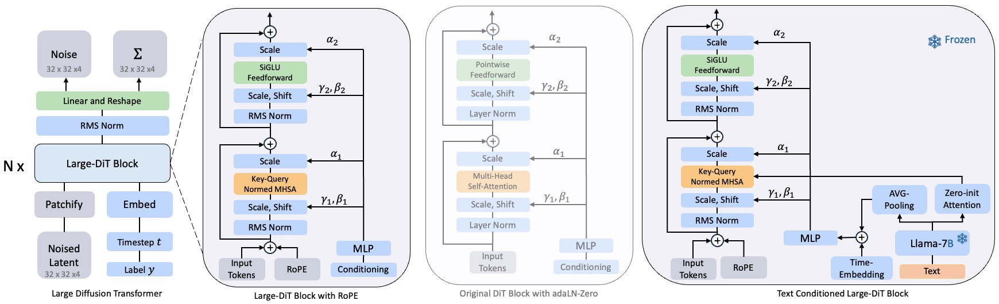

# Large-DiT

We have released the Large Diffusion Transformer (L-DiT-7B), inspired by the architectures of LLaMa and DiT. L-DiT-7B achieves comparable performance to DiT-XL/2, with an FID of 2.37 versus 2.27, while requiring only 1/14th of the training steps—500K iterations compared to 7M iterations.

