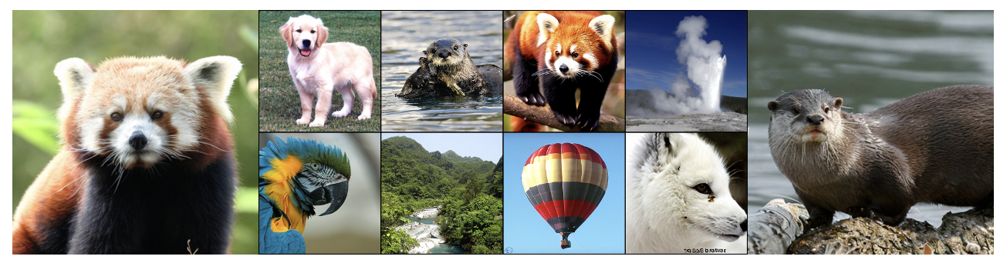
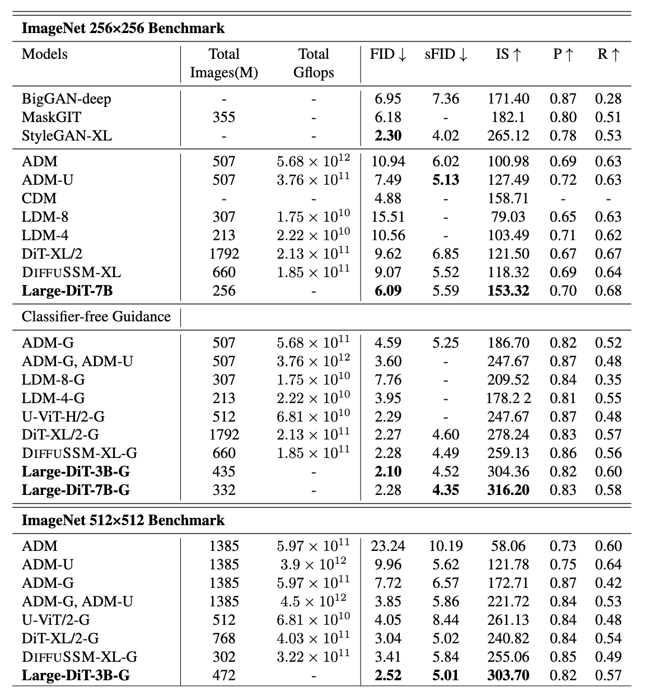

# Large Diffusion Transformer 🎆

We release the ***Large Diffusion Transformer*** (**L-DiT-3B** & **L-DiT-7B** 🔥), inspired by the methodologies of [LLaMA](https://github.com/facebookresearch/llama) and [DiT](https://github.com/facebookresearch/DiT). 


Compared to DiT-XL/2, our L-DiT-7B:
- 💪 Achieves **comparable performance**, 2.37 versus 2.27 FID on ImageNet
- 🚀 Requires only **7% of the training steps**, 500K versus 7M iterations

## Introduction

We observe instability issues during the training of the original DiT, particularly when using low-bit training modes and parameter scaling up. Considering that the LLaMA architecture has been rigorously validated as a scalable, causal transformer architecture for large language models, we thus employ the architectures of LLaMA to DiT to make the best of both worlds.


### Contribution
- We introduce Large-DiT to incorporate the methodologies of LLaMA and DiT. Specifically, we modify the causal attention of LLaMA to a bi-directional attention mechanism. Further, we normalize the key and query within the attention mechanism, which allows Large-DiT to be trained in BF16 mode with improved scalability.

- By utilizing the architecture of Large-DiT, we can scale up the parameters from 600M to 7 billion. This parameter scaling-up has significantly improved the convergence speed for the label-conditioned ImageNet generation. This demonstrates the potential of scaling-up diffusion transformers for enhanced performance and faster convergence.

- We have made all training, inference, and evaluation codes publicly available, supporting further research on scaling Diffusion Transformers.

### ImageNet 256x256 Samples and Benchmark

<div>
     <br>
</div>

## Model zoo

We currently release the following model checkpoints.

| Model size | Step   | Batch Size | Download URL    |
| ---------- | ------ | ---------- | --------------- |
| 3B         | 1.3M   | 256        |[huggingface](https://huggingface.co/Alpha-VLLM/Large-DiT/tree/main/240218_3b_bs256_step1350k) |
| 7B         | 620k   | 512        |[huggingface](https://huggingface.co/Alpha-VLLM/Large-DiT/tree/main/240218_7b_bs512_step620k) |

## Installation

1. Create a conda environment and install PyTorch. You may want to adjust the CUDA version [according to your driver version](https://docs.nvidia.com/deploy/cuda-compatibility/#default-to-minor-version).

```bash
conda create -n large_dit
conda activate large_dit
conda install pytorch==2.1.0 torchvision==0.16.0 torchaudio==2.1.0 pytorch-cuda=12.1 -c pytorch -c nvidia
```

2. Install other dependencies.

```bash
pip install diffusers fairscale accelerate tensorboard
```

3. Install [nvidia apex](https://github.com/nvidia/apex). Before installation, ensure that
you have a working ``nvcc``

```bash
nvcc --version
# The command should work and show the same version number as in step 1 (12.1 in our case).
```

On some outdated distros (e.g., CentOS 7), you may also want to check that a late enough version of
``gcc`` is available

```bash
gcc --version
# The command should work and show a version of at least 6.0.
# If not, consult distro-specific tutorials to obtain a newer version or build manually.
```

Then, clone the repo and install following the official guidelines (note that we expect a full
build, i.e., with CUDA and C++ extensions)

```bash
pip install ninja
git clone https://github.com/NVIDIA/apex
cd apex
# if pip >= 23.1 (ref: https://pip.pypa.io/en/stable/news/#v23-1) which supports multiple `--config-settings` with the same key... 
pip install -v --disable-pip-version-check --no-cache-dir --no-build-isolation --config-settings "--build-option=--cpp_ext" --config-settings "--build-option=--cuda_ext" ./
# otherwise
pip install -v --disable-pip-version-check --no-cache-dir --no-build-isolation --global-option="--cpp_ext" --global-option="--cuda_ext" ./
```

4. Install ``flash-attn``

```bash
pip install flash-attn --no-build-isolation
```

## Sampling images

1. Download one of the checkpoints from the [model zoo](#model-zoo). Each checkpoint contains multiple files, which are to be put in the same folder (e.g., ``/path/to/checkpoint``).

2. Run ``sample.py``. You may use the following minimum runnable examples, or adjust some arguments according to the help document (by running ``python -u sample.py --help``).

```bash
# The default configuration.
python -u sample.py --ckpt /path/to/checkpoint

# If memory limited, use fp16 or bf16 precision
python -u sample.py --ckpt /path/to/checkpoint --precision fp16
python -u sample.py --ckpt /path/to/checkpoint --precision fp16

# If the VAE weights, which are not contained in our released checkpoints, cannot be downloaded automaticaly,
# manually download from https://huggingface.co/stabilityai/sd-vae-ft-ema/tree/main
# and put them into a folder e.g., /path/to/diffusers_models/stabilityai/sd-vae-ft-ema.
python -u sample.py --ckpt /path/to/checkpoint --local_diffusers_model_root /path/to/diffusers_models
```

## Training

1. Prepare the dataset. The repo supports image classification datasets (e.g., ImageNet) and expect the images to be organized so that all images for each class are put in a separate folder

```
/path/to/training_images
├── class_name_1
│   ├── class_1_img_1.JPEG
│   ├── class_1_img_2.JPEG
│   ├── class_1_img_3.JPEG
├── class_name_2
│   ├── class_2_img_1.JPEG
│   ├── class_2_img_2.JPEG
│   ├── class_2_img_3.JPEG
...
```

2. Example training scripts are provided in the [exps](exps/) folder. Change the training images path (``train_data_root=...``) before running the scripts. The scripts are for 8xA100-80G machines, and you may need to reduce ``--micro_batch_size`` or model size in case of OOM.


## Acknowledgements

The codebase is extended from [DiT](https://github.com/facebookresearch/DiT) and [LLaMA](https://github.com/facebookresearch/llama). This project is also highly motivated by [PixArt-alpha](https://github.com/PixArt-alpha/PixArt-alpha) and [JourneyDB](https://journeydb.github.io/). Thanks for their awesome work!
