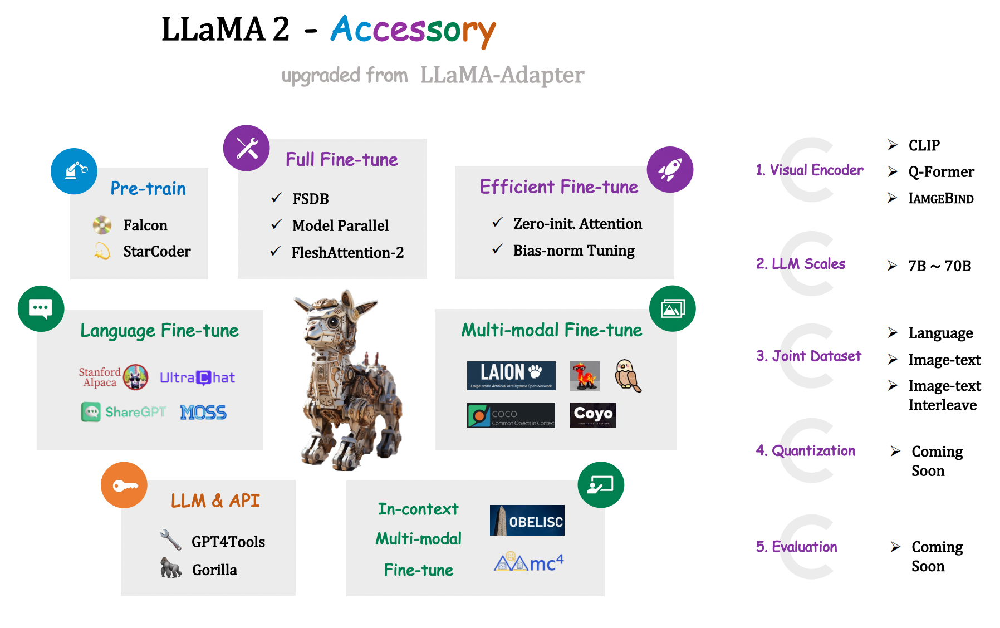

# LLaMA2-Accesory: An Open-source Toolkit for LLM Development 🚀

                                                                                               

Welcome to **LLaMa2-Accessory,** your comprehensive open-source solution for LLM development, built to support a wide variety of models and applications. 

## News
- **[2023.07.21]** Initial release 📌

## Features

LLaMA2-Accesory supports the pretrain, full-paratemeter finetune, paramter-efficient finetune, multimodality finetune and in-context multimodality finetune. 

### Dataset Support

1. **Pretraining Support**: Allows pretraining on the StarCoder dataset and the RefinedWeb dataset, offering a strong basis for subsequent task-specific model adjustments.
   
2. **Finetuning Support**: Supports finetuning on a variety of datasets including Alpaca, ShareGPT, UltraLM, and MOSS, enabling customization for diverse applications.

3. **Multimodality Finetuning**: Offers multimodal finetuning with datasets like COCO, SBU, COYO, Shrika, Laion, VQA, and LLaVa. This broadens the capability of models to understand and generate outputs based on various forms of inputs, such as images, text, and audio.

4. **In-context Multimodality Finetuning**: Employs the MMC4 and Obelisc for in-context multimodality finetuning, bringing an enhanced level of understanding and nuance to models dealing with multimodal data.

### Efficient Optimization and Scalability

1. **Parameter-Efficient Finetuning (PEFT) Methods**: Includes a range of PEFT techniques such as Zero-Init Attention, Bias-Norm-Tuning, LoRa. These are designed to optimize the training process, yielding better model performance with more efficient parameter usage.
   
2. **Scalability**: Provides FSDP and Model-parallel support for flexible finetuning that ranges from 7B to 70B. This ensures the solution's ability to handle a wide range of model complexities and sizes, accommodating both smaller and larger scale applications.

###  Pretrained Multimodal Visual-and-Language Models 

1. **CLIP**: A multimodal vision-and-language model developed by OpenAI, leveraging contrastive learning to map images and their textual descriptions into a shared semantic space, enabling versatile downstream applications.

2. **Q-Former**: A lightweight Transformer architecture that employs a set of learnable query vectors to extract relevant visual features from a frozen image encoder, streamlining the provision of useful visual cues for language model to generate related textual output.

3. **ImageBind**: A model that learns a joint embedding across six different modalities - images, text, audio, depth, thermal, and IMU data, facilitating emergent applications such as cross-modal retrieval, composing modalities with arithmetic, and cross-modal detection and generation.

## Installation

See [docs/install.md](./docs/install.md). 

## Pre-train & Fine-tune
See [docs/finetune.md](./docs/finetune.md). 

## Examples
We provide some examples of [instruction-tuned LLaMA2](./docs/demo_instruct.md) and [Chatbot LLaMA2](./docs/demo_dialog.md).

## Core Contributors

[Chris Liu](https://github.com/ChrisLiu6), [Jiaming Han](https://github.com/csuhan), [Ziyi Lin](https://github.com/linziyi96), [Guian Fang](https://github.com/Enderfga), [Peng Gao](https://github.com/gaopengpjlab)

## Acknowledgement
+ [@facebookresearch](https://github.com/facebookresearch) for [llama](https://github.com/facebookresearch/llama) & [ImageBind](https://github.com/facebookresearch/ImageBind)
+ [@OpenGVLab](https://github.com/OpenGVLab) for [LLaMA-Adapter](https://github.com/OpenGVLab/LLaMA-Adapter)
+ [@Instruction-Tuning-with-GPT-4](https://github.com/Instruction-Tuning-with-GPT-4) for [GPT-4-LLM](https://github.com/Instruction-Tuning-with-GPT-4/GPT-4-LLM)
+ [@tatsu-lab](https://github.com/tatsu-lab) for [stanford_alpaca](https://github.com/tatsu-lab/stanford_alpaca)
+ [@tloen](https://github.com/tloen) for [alpaca-lora](https://github.com/tloen/alpaca-lora)
+ [@lm-sys](https://github.com/lm-sys) for [FastChat](https://github.com/lm-sys/FastChat)
+ [@domeccleston](https://github.com/domeccleston) for [sharegpt](https://github.com/domeccleston/sharegpt)
+ [@karpathy](https://github.com/karpathy) for [nanoGPT](https://github.com/karpathy/nanoGPT)
+ [@Dao-AILab](https://github.com/Dao-AILab) for [flash-attention](https://github.com/Dao-AILab/flash-attention)
+ [@NVIDIA](https://github.com/NVIDIA) for [apex](https://github.com/NVIDIA/apex) & [Megatron-LM](https://github.com/NVIDIA/Megatron-LM)
+ [@Vision-CAIR](https://github.com/Vision-CAIR) for [MiniGPT-4](https://github.com/Vision-CAIR/MiniGPT-4)
+ [@haotian-liu](https://github.com/haotian-liu) for [LLaVA](https://github.com/haotian-liu/LLaVA)
+ [@huggingface](https://github.com/huggingface) for [peft](https://github.com/huggingface/peft) & [OBELISC](https://github.com/huggingface/OBELISC)
+ [@Lightning-AI](https://github.com/Lightning-AI) for [lit-gpt](https://github.com/Lightning-AI/lit-gpt) & [lit-llama](https://github.com/Lightning-AI/lit-llama)
+ [@allenai](https://github.com/allenai) for [mmc4](https://github.com/allenai/mmc4)
+ [@StevenGrove](https://github.com/StevenGrove) for [GPT4Tools](https://github.com/StevenGrove/GPT4Tools)
+ [@ShishirPatil](https://github.com/ShishirPatil) for [gorilla](https://github.com/ShishirPatil/gorilla)
+ [@OpenLMLab](https://github.com/OpenLMLab) for [MOSS](https://github.com/OpenLMLab/MOSS)
+ [@thunlp](https://github.com/thunlp) for [UltraChat](https://github.com/thunlp/UltraChat)
+ [@LAION-AI](https://github.com/LAION-AI) for [LAION-5B](https://laion.ai/blog/laion-5b/)
+ [@shikras](https://github.com/shikras) for [shikra](https://github.com/shikras/shikra)
+ [@kakaobrain](https://github.com/kakaobrain) for [coyo-dataset](https://github.com/kakaobrain/coyo-dataset)
+ [@salesforce](https://github.com/salesforce) for [LAVIS](https://github.com/salesforce/LAVIS)
+ [@openai](https://github.com/openai) for [CLIP](https://github.com/openai/CLIP)
+ [@bigcode-project](https://github.com/bigcode-project) for [starcoder](https://github.com/bigcode-project/starcoder)
+ [@tiiuae](https://huggingface.co/tiiuae) for [falcon-refinedweb](https://huggingface.co/datasets/tiiuae/falcon-refinedweb)
+ [@microsoft](https://github.com/microsoft) for [DeepSpeed](https://github.com/microsoft/DeepSpeed)
+ [@declare-lab](https://github.com/declare-lab) for [flacuna](https://github.com/declare-lab/flacuna)
+ [@Google](https://github.com/google) for [Bard](https://bard.google.com/)
