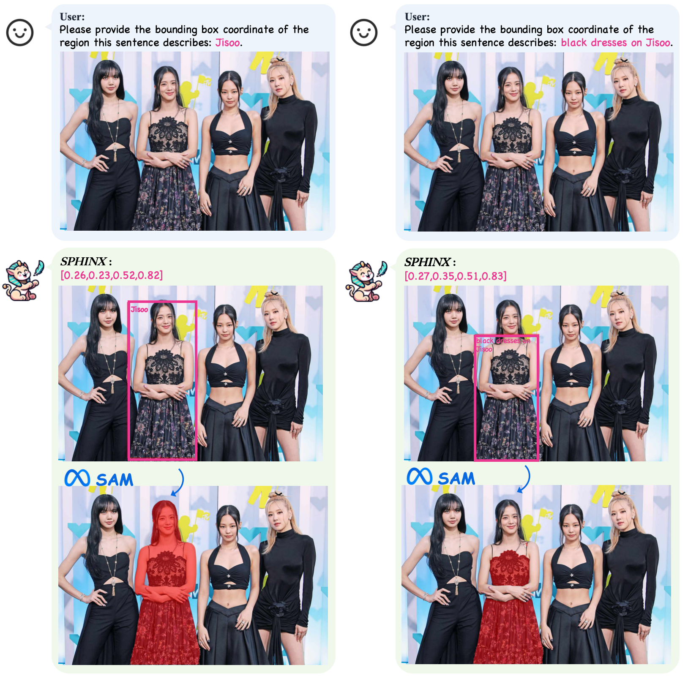

# LLaMA2-Accessory: An Open-source Toolkit for LLM Development 🚀

<p align="center">
  
 <br>
</p>

<p align="center">
   📖 <a href="https://llama2-accessory.readthedocs.io" target="_blank">Document</a>
</p>
<p align="center">
   🤗 <a href="https://huggingface.co/Alpha-VLLM/SPHINX" target="_blank">HF Repo</a> • 👋 join our <a href="http://imagebind-llm.opengvlab.com/qrcode/" target="_blank">WeChat</a> • 🚀 <a href="http://imagebind-llm.opengvlab.com/" target="_blank">Demo</a>
</p>

🚀**LLaMA2-Accessory** is an open-source toolkit for pretraining, finetuning and deployment of **Large Language Models (LLMs)** and **multimodal LLMs**. This repo is mainly inherited from [LLaMA-Adapter](https://github.com/OpenGVLab/LLaMA-Adapter) with more advanced features.🧠

✨Within this toolkit, we present **SPHINX**, a versatile multimodal large language model (MLLM) that combines a diverse array of training tasks, data domains, and visual embeddings.

## News
- **[2024-1-27]** [SPHINX-MoE](https://huggingface.co/Alpha-VLLM/LLaMA2-Accessory/tree/main/finetune/mm/SPHINX) achieves **29.57%** and **29.33%** accuracy results on [CMMMU-test](https://github.com/CMMMU-Benchmark/CMMMU) and [CMMMU-val](https://github.com/CMMMU-Benchmark/CMMMU) respectively.
- **[2024-1-24]** [SPHINX-MoE](https://huggingface.co/Alpha-VLLM/LLaMA2-Accessory/tree/main/finetune/mm/SPHINX) achieves new SOTA performance (**49.33%**) on [MMVP](https://github.com/tsb0601/MMVP), higher than GPT-4V! 🔥🔥🔥
- **[2024-1-20]** [SPHINX-MoE](https://huggingface.co/Alpha-VLLM/LLaMA2-Accessory/tree/main/finetune/mm/SPHINX) achieves SOTA performance on [AesBench](https://github.com/yipoh/AesBench/tree/main)! 🔥🔥🔥
- **[2024-1-18]** [LLaMA-Adapter](https://arxiv.org/pdf/2303.16199.pdf) is accepted by **ICLR 2024**!🎉
- **[2024-1-12]** We release SPHINX-Tiny built on the compact 1.1B [TinyLlama](https://huggingface.co/TinyLlama/TinyLlama-1.1B-intermediate-step-1195k-token-2.5T) that everyone can play with! 🔥🔥🔥
- **[2024-1-5]** [OpenCompass](https://github.com/open-compass/opencompass) now supports seamless evaluation of all LLaMA2-Accessory models. 🔥🔥🔗[Doc](https://llama2-accessory.readthedocs.io/en/latest/evaluation.html)
- **[2024-1-2]** We release the [SPHINX-MoE](https://huggingface.co/Alpha-VLLM/LLaMA2-Accessory/tree/main/finetune/mm/SPHINX), a MLLM based on Mixtral-8x7B-MoE. 🔥🔥🔥
- **[2023-12-12]** [SPHINX-V2](https://github.com/Alpha-VLLM/LLaMA2-Accessory/tree/main/SPHINX) achieve outstanding results in [InfiMM-Eval](https://paperswithcode.com/sota/visual-question-answering-vqa-on-core-mm), ranking just below GPT4-V! 🔥🔥🔥
- **[2023-12-11]** We now support [mixtral-8x7b](https://llama2-accessory.readthedocs.io/en/latest/projects/mixtral-8x7b.html) inference and finetuning! 🔥🔥🔥
- **[2023-12-08]** We release [OneLLM](https://github.com/csuhan/OneLLM) which aligns **eight** modalities to language using a unified framework!🔥🔥🔥
- **[2023-11-17]** We release [SPHINX-V2](https://github.com/Alpha-VLLM/LLaMA2-Accessory/tree/main/SPHINX), the same architecture but enhanced capabilities! 🔥🔥🔥
- **[2023.10.17]** We release the demo, code, and model of [SPHINX](https://github.com/Alpha-VLLM/LLaMA2-Accessory/tree/main/SPHINX)!🔥🔥
- **[2023.09.15]** We now support Falcon 180B!🔥🔥
- **[2023.09.14]** [WeMix-LLaMA2-70B](https://github.com/Alpha-VLLM/WeMix-LLM) shows excellent performance on the [OpenCompass](https://opencompass.org.cn/leaderboard-llm) benchmark!🔥🔥
- **[2023.09.02]** We now support InternLM🔥
- **[2023.08.28]** We release quantized LLM with [OmniQuant](https://github.com/OpenGVLab/OmniQuant), which is an efficient, accurate, and omnibearing (even extremely low bit) quantization algorithm. Multimodal version is coming soon
- **[2023.08.27]** We now support CodeLLaMA and instruction finetuning on [evol-code-alpaca](https://huggingface.co/datasets/theblackcat102/evol-codealpaca-v1)
- **[2023.08.27]** We release our documentation in a webbook format 🔗[Check it out here](https://llama2-accessory.readthedocs.io/)
- **[2023.08.21]** We release the Quantization codes and Evaluation result
- **[2023.08.05]** We release the multimodel finetuning codes and checkpoints
- **[2023.07.23]** Initial release 📌

## Features
* **💡Support More Datasets and Tasks**
  - 🎯 Pretraining with [RefinedWeb](https://huggingface.co/datasets/tiiuae/falcon-refinedweb) and [StarCoder](https://github.com/bigcode-project/starcoder).
  - 📚 Single-modal finetuning with [Alpaca](https://github.com/tatsu-lab/stanford_alpaca), [ShareGPT](https://github.com/domeccleston/sharegpt), [LIMA](https://arxiv.org/pdf/2305.11206.pdf), [WizardLM](https://github.com/nlpxucan/WizardLM), [Flacuna](https://github.com/declare-lab/flacuna), [Platypus](https://github.com/arielnlee/Platypus), [UltraChat](https://github.com/thunlp/UltraChat) and [MOSS](https://github.com/OpenLMLab/MOSS).
  - 🌈 Multi-modal finetuning with image-text pairs ([LAION](https://laion.ai/blog/laion-5b/), [COYO](https://github.com/kakaobrain/coyo-dataset) and more), interleaved image-text data ([MMC4](https://github.com/allenai/mmc4) and [OBELISC](https://github.com/huggingface/OBELISC)) and visual instruction data ([LLaVA](https://github.com/haotian-liu/LLaVA), [Shrika](https://github.com/shikras/shikra), [Bard](https://bard.google.com/))
  - 🔧 LLM for API Control ([GPT4Tools](https://github.com/StevenGrove/GPT4Tools) and [Gorilla](https://github.com/ShishirPatil/gorilla)).
* **⚡Efficient Optimization and Deployment**
  - 🚝 Parameter-efficient finetuning with [Zero-init Attenion](https://github.com/OpenGVLab/LLaMA-Adapter) and [Bias-norm Tuning](https://github.com/OpenGVLab/LLaMA-Adapter).
  - 💻 Fully Sharded Data Parallel ([FSDP](https://engineering.fb.com/2021/07/15/open-source/fsdp/)), [Flash Attention 2](https://github.com/Dao-AILab/flash-attention) and [QLoRA](https://github.com/artidoro/qlora).
* **🏋️‍♀️Support More Visual Encoders and LLMs**

  - 👁‍🗨 Visual Encoders: [CLIP](https://github.com/openai/CLIP), [Q-Former](https://github.com/salesforce/LAVIS), [ImageBind](https://github.com/facebookresearch/ImageBind) and [DINOv2](https://github.com/facebookresearch/dinov2).
  - 🧩 LLMs: LLaMA, LLaMA2, CodeLlama, InternLM, Falcon and Mixtral-8x7B.

## Setup

:gear: For environment installation, please refer to [Environment Setup](https://llama2-accessory.readthedocs.io/en/latest/install.html).

## Model Usage

:robot: Instructions for model [pretraining](https://llama2-accessory.readthedocs.io/en/latest/pretrain.html), [finetuning](https://llama2-accessory.readthedocs.io/en/latest/finetune/index.html), [inference](https://llama2-accessory.readthedocs.io/en/latest/inference.html), and other related topics are all available in the [document](https://llama2-accessory.readthedocs.io).

## Frequently Asked Questions (FAQ)

:question: Encountering issues or have further questions? Find answers to common inquiries [here](https://llama2-accessory.readthedocs.io/en/latest/faq.html). We're here to assist you!

## Demos
* Instruction-tuned LLaMA2: [alpaca](https://alpha-vllm.github.io/demo_presentation/examples/finetune/sg/alpaca.html) & [gorilla](https://alpha-vllm.github.io/demo_presentation/examples/finetune/sg/gorilla.html).
* Chatbot LLaMA2: [dialog_sharegpt](https://alpha-vllm.github.io/demo_presentation/examples/finetune/sg/dialog_sharegpt.html) & [dialog_lima](https://alpha-vllm.github.io/demo_presentation/examples/finetune/sg/dialog_lima.html) & [llama2-chat](https://alpha-vllm.github.io/demo_presentation/examples/finetune/sg/llama2-chat.html).
* Multimodal LLaMA2: [in-context](https://alpha-vllm.github.io/demo_presentation/examples/finetune/mm/in-context.html) & [alpacaLlava_llamaQformerv2_13b](https://alpha-vllm.github.io/demo_presentation/examples/finetune/mm/alpacaLlava_llamaQformerv2_13b.html)
* SPHINX: [demo](https://github.com/Alpha-VLLM/LLaMA2-Accessory/blob/main/SPHINX/README.md#demo)

💡 Now, our model SPHINX supports generating high-quality bounding boxes and then present masks created by [SAM](https://github.com/facebookresearch/segment-anything/tree/main) for all objects within an image driven by input prompts. Give it a try [here](http://imagebind-llm.opengvlab.com/)! 🚀




## Core Contributors

[Chris Liu](https://github.com/ChrisLiu6), [Ziyi Lin](https://github.com/linziyi96), [Guian Fang](https://github.com/Enderfga), [Jiaming Han](https://github.com/csuhan), [Yijiang Liu](https://github.com/kriskrisliu), [Renrui Zhang](https://github.com/ZrrSkywalker), [Longtian Qiu](https://github.com/Artanic30), [Yichi Zhang](https://github.com/void721), [Siyuan Huang](https://github.com/SiyuanHuang95)

## Project Leader

[Peng Gao](https://github.com/gaopengpjlab), [Wenqi Shao](https://github.com/wqshao126), [Shanghang Zhang](https://scholar.google.com/citations?user=voqw10cAAAAJ&hl=en)

## Hiring Announcement

🔥 **We are hiring** interns, postdocs, and full-time researchers at the **General Vision Group, Shanghai AI Lab**, with a focus on multi-modality and vision foundation models. If you are interested, please contact [gaopengcuhk@gmail.com](mailto:gaopengcuhk@gmail.com).

## Citation
If you find our code and paper useful, please kindly cite:
```bash
@article{zhang2023llamaadapter,
  title = {LLaMA-Adapter: Efficient Finetuning of Language Models with Zero-init Attention},
  author={Zhang, Renrui and Han, Jiaming and Liu, Chris and Gao, Peng and Zhou, Aojun and Hu, Xiangfei and Yan, Shilin and Lu, Pan and Li, Hongsheng and Qiao, Yu},
  journal={arXiv preprint arXiv:2303.16199},
  year={2023}
}
```
```bash
@article{gao2023llamaadapterv2,
  title = {LLaMA-Adapter V2: Parameter-Efficient Visual Instruction Model},
  author={Gao, Peng and Han, Jiaming and Zhang, Renrui and Lin, Ziyi and Geng, Shijie and Zhou, Aojun and Zhang, Wei and Lu, Pan and He, Conghui and Yue, Xiangyu and Li, Hongsheng and Qiao, Yu},
  journal={arXiv preprint arXiv:2304.15010},
  year={2023}
}
```

## Acknowledgement
+ [@facebookresearch](https://github.com/facebookresearch) for [llama](https://github.com/facebookresearch/llama)
+ [@OpenGVLab](https://github.com/OpenGVLab) for [LLaMA-Adapter](https://github.com/OpenGVLab/LLaMA-Adapter)
<details><summary>Show More</summary>

+ [@facebookresearch](https://github.com/facebookresearch) for [ImageBind](https://github.com/facebookresearch/ImageBind) & [LIMA](https://huggingface.co/datasets/64bits/lima_vicuna_format) & [CodeLlama](https://github.com/facebookresearch/codellama)
+ [@Instruction-Tuning-with-GPT-4](https://github.com/Instruction-Tuning-with-GPT-4) for [GPT-4-LLM](https://github.com/Instruction-Tuning-with-GPT-4/GPT-4-LLM)
+ [@tatsu-lab](https://github.com/tatsu-lab) for [stanford_alpaca](https://github.com/tatsu-lab/stanford_alpaca)
+ [@tloen](https://github.com/tloen) for [alpaca-lora](https://github.com/tloen/alpaca-lora)
+ [@lm-sys](https://github.com/lm-sys) for [FastChat](https://github.com/lm-sys/FastChat)
+ [@domeccleston](https://github.com/domeccleston) for [sharegpt](https://github.com/domeccleston/sharegpt)
+ [@karpathy](https://github.com/karpathy) for [nanoGPT](https://github.com/karpathy/nanoGPT)
+ [@Dao-AILab](https://github.com/Dao-AILab) for [flash-attention](https://github.com/Dao-AILab/flash-attention)
+ [@NVIDIA](https://github.com/NVIDIA) for [apex](https://github.com/NVIDIA/apex) & [Megatron-LM](https://github.com/NVIDIA/Megatron-LM)
+ [@Vision-CAIR](https://github.com/Vision-CAIR) for [MiniGPT-4](https://github.com/Vision-CAIR/MiniGPT-4)
+ [@haotian-liu](https://github.com/haotian-liu) for [LLaVA](https://github.com/haotian-liu/LLaVA)
+ [@huggingface](https://github.com/huggingface) for [peft](https://github.com/huggingface/peft) & [OBELISC](https://github.com/huggingface/OBELISC)
+ [@Lightning-AI](https://github.com/Lightning-AI) for [lit-gpt](https://github.com/Lightning-AI/lit-gpt) & [lit-llama](https://github.com/Lightning-AI/lit-llama)
+ [@allenai](https://github.com/allenai) for [mmc4](https://github.com/allenai/mmc4)
+ [@StevenGrove](https://github.com/StevenGrove) for [GPT4Tools](https://github.com/StevenGrove/GPT4Tools)
+ [@ShishirPatil](https://github.com/ShishirPatil) for [gorilla](https://github.com/ShishirPatil/gorilla)
+ [@OpenLMLab](https://github.com/OpenLMLab) for [MOSS](https://github.com/OpenLMLab/MOSS)
+ [@thunlp](https://github.com/thunlp) for [UltraChat](https://github.com/thunlp/UltraChat)
+ [@LAION-AI](https://github.com/LAION-AI) for [LAION-5B](https://laion.ai/blog/laion-5b/)
+ [@shikras](https://github.com/shikras) for [shikra](https://github.com/shikras/shikra)
+ [@kakaobrain](https://github.com/kakaobrain) for [coyo-dataset](https://github.com/kakaobrain/coyo-dataset)
+ [@salesforce](https://github.com/salesforce) for [LAVIS](https://github.com/salesforce/LAVIS)
+ [@openai](https://github.com/openai) for [CLIP](https://github.com/openai/CLIP)
+ [@bigcode-project](https://github.com/bigcode-project) for [starcoder](https://github.com/bigcode-project/starcoder)
+ [@tiiuae](https://huggingface.co/tiiuae) for [falcon-refinedweb](https://huggingface.co/datasets/tiiuae/falcon-refinedweb)
+ [@microsoft](https://github.com/microsoft) for [DeepSpeed](https://github.com/microsoft/DeepSpeed)
+ [@declare-lab](https://github.com/declare-lab) for [flacuna](https://github.com/declare-lab/flacuna)
+ [@nlpxucan](https://github.com/nlpxucan) for [WizardLM](https://github.com/nlpxucan/WizardLM)
+ [@arielnlee](https://github.com/arielnlee) for [Platypus](https://github.com/arielnlee/Platypus)
+ [@InternLM](https://github.com/InternLM) for [InternLM](https://github.com/InternLM/InternLM)
+ [@Google](https://github.com/google) for [Bard](https://bard.google.com/)
</details>

## License

Llama 2 is licensed under the [LLAMA 2 Community License](LICENSE_llama2), Copyright (c) Meta Platforms, Inc. All Rights Reserved.
