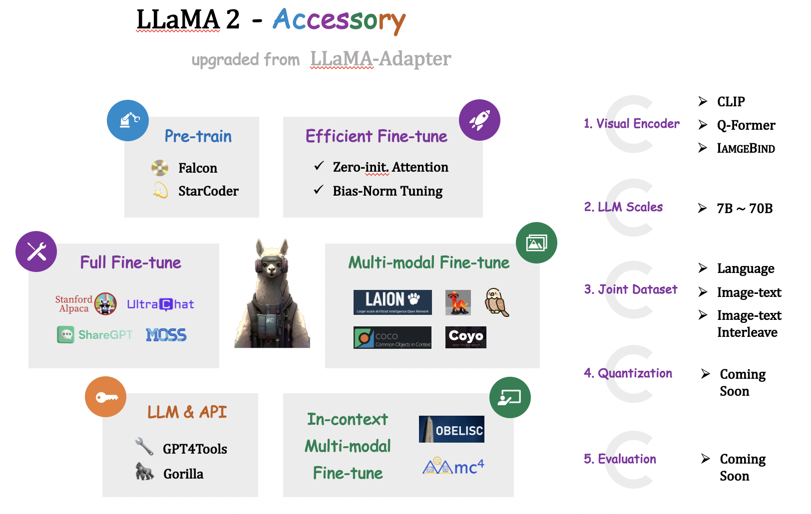

# LLaMA-Accesory: An Open-source Toolkit for Multimodal Model Finetuning 🚀

                                                                                                                                            

Welcome to **LLaMa2-Accessory,** your comprehensive open-source solution for pretrained model finetuning, built to support a wide variety of models and applications. 

Our toolkit provides a comprehensive set of tools for pretraining, full-parameter finetuning, parameter-efficient finetuning, multimodality finetuning, and in-context multimodality finetuning.

## News
- **[2023.07.21]** The training code for **LLaMA2** are released. 📌

## Features

LLaMa2-Accesory comes loaded with a suite of capabilities to cater to diverse needs:

#### Model Training and Finetuning
These features provide the foundation for the pretraining and finetuning of your models.

1. **Pretraining Support**: Allows pretraining on the StarCoder dataset and the RefinedWeb dataset, offering a strong basis for subsequent task-specific model adjustments.
   
2. **Finetuning Support**: Supports finetuning on a variety of datasets including Alpaca, ShareGPT, UltraLM, and MOSS, enabling customization for diverse applications.

3. **Parameter-Efficient Finetuning (PEFT) Methods**: Includes a range of PEFT techniques such as Zero-Init Attention, Bias-Norm-Tuning, LoRa. These are designed to optimize the training process, yielding better model performance with more efficient parameter usage.

4. **Multimodality Finetuning**: Offers multimodal finetuning with datasets like COCO, SBU, COYO, Shrika, Laion, VQA, and LLaVa. This broadens the capability of models to understand and generate outputs based on various forms of inputs, such as images, text, and audio.

5. **In-context Multimodality Finetuning**: Employs the MMC4 and Obelisc for in-context multimodality finetuning, bringing an enhanced level of understanding and nuance to models dealing with multimodal data.

#### Advanced Optimization and Scalability
These features provide methods to enhance the efficiency, scalability, and flexibility of the model training process.

1. **Visual Encoder**: Integrates the state-of-the-art CLIP, Q-former and Imagebind visual encoders. This brings cutting-edge image encoding technology to your models, improving their understanding and interpretation of visual data.

2. **Scalability**: Provides FSDP and Model-parallel support for flexible finetuning that ranges from 7B to 70B. This ensures the solution's ability to handle a wide range of model complexities and sizes, accommodating both smaller and larger scale applications.

3. **Dataset Concatenation**: Enables joint training of langauge, multimodal, and image-text interleaved datasets. This increases the diversity and complexity of the training data, leading to models that are better equipped to handle a variety of real-world scenarios.

## Installation

see [docs/install.md](./docs/install.md) for details. 

## Usage

To be added.

# Pre-train & Fine-tune
codes for pre-train and fine-tune are available in `./accessory`, see [docs/finetune.md](./docs/finetune.md) for details. 

## License

Distributed under the MIT License. See `LICENSE` for more information.

## Contributors

## Citation

## Acknowledgement
This repo benefits from [LLaMA](https://github.com/facebookresearch/llama), [Stanford Alpaca](https://github.com/tatsu-lab/stanford_alpaca), and [Alpaca-Lora](https://github.com/tloen/alpaca-lora). Thanks for their wonderful works.