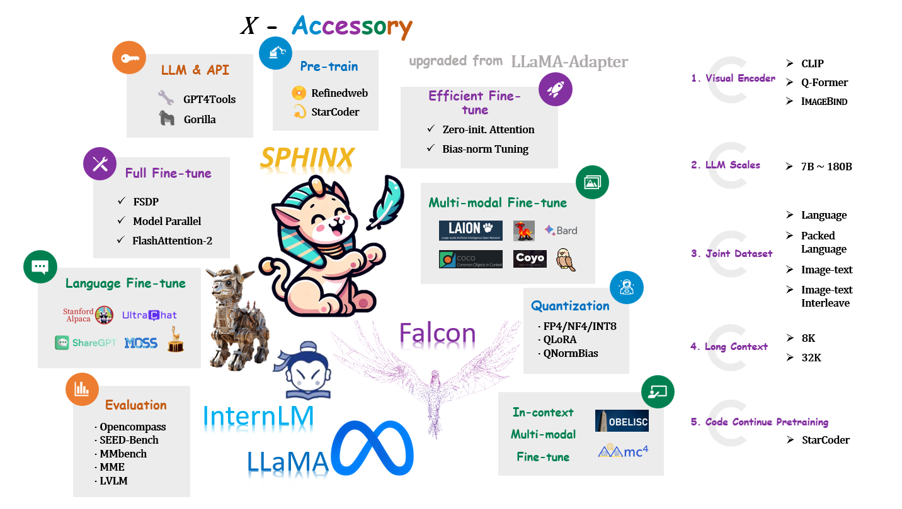

# LLaMA2-Accessory: An Open-source Toolkit for LLM Development 🚀

  
  

**LLaMA2-Accessory** is an open-source toolkit for pre-training, fine-tuning and deployment of **Large Language Models (LLMs)** and **mutlimodal LLMs**. This repo is mainly inherited from [LLaMA-Adapter](https://github.com/OpenGVLab/LLaMA-Adapter) with more advanced features.

## News
- **[2023.07.23]** Initial release 📌

## Features
* **Support More Datasets and Tasks**

  - Pre-training with [RefinedWeb](https://huggingface.co/datasets/tiiuae/falcon-refinedweb) and [StarCoder](https://github.com/bigcode-project/starcoder).
  - Single-modal fine-tuning with [Alpaca](https://github.com/tatsu-lab/stanford_alpaca), [ShareGPT](https://github.com/domeccleston/sharegpt), [LIMA](https://arxiv.org/pdf/2305.11206.pdf), [UltraChat](https://github.com/thunlp/UltraChat) and [MOSS](https://github.com/OpenLMLab/MOSS).
  - Multi-modal fine-tuning with image-text pairs ([LAION](https://laion.ai/blog/laion-5b/), [COYO](https://github.com/kakaobrain/coyo-dataset) and more), interleaved image-text data ([MMC4](https://github.com/allenai/mmc4) and [OBELISC](https://github.com/huggingface/OBELISC)) and visual instruction data ([LLaVA](https://github.com/haotian-liu/LLaVA), [Shrika](https://github.com/shikras/shikra), [Bard](https://bard.google.com/))
  -  LLM for API Control ([GPT4Tools](https://github.com/StevenGrove/GPT4Tools) and [Gorilla](https://github.com/ShishirPatil/gorilla)).
* **Efficient Optimization and Deployment**

  - Parameter-efficient fine-tuning with [Zero-init Attenion](https://github.com/OpenGVLab/LLaMA-Adapter) and [Bias-norm Tuning](https://github.com/OpenGVLab/LLaMA-Adapter).
  - Fully Sharded Data Parallel ([FSDP](https://engineering.fb.com/2021/07/15/open-source/fsdp/)), [Flash Attention 2](https://github.com/Dao-AILab/flash-attention) and [QLoRA](https://github.com/artidoro/qlora).
* **Support More Visual Encoders and LLMs**
  - Visual Encoders: [CLIP](https://github.com/openai/CLIP), [Q-Former](https://github.com/salesforce/LAVIS) and [ImageBind](https://github.com/facebookresearch/ImageBind).
  - LLMs: LLaMA and LLaMA2.

## Installation

See [docs/install.md](./docs/install.md). 

## Training & Inference
See [docs/pretrain.md](./docs/pretrain.md) and [docs/finetune.md](./docs/finetune.md). 

## Demos
* instruction-tuned LLaMA2: [alpaca](https://alpha-vllm.github.io/demo_presentation/examples/finetune/sg/alpaca.html) & [gorilla](https://alpha-vllm.github.io/demo_presentation/examples/finetune/sg/gorilla.html).
* Chatbot LLaMA2: [dialog_sharegpt](https://alpha-vllm.github.io/demo_presentation/examples/finetune/sg/dialog_sharegpt.html) & [dialog_lima](https://alpha-vllm.github.io/demo_presentation/examples/finetune/sg/dialog_lima.html) & [llama2-chat](https://alpha-vllm.github.io/demo_presentation/examples/finetune/sg/llama2-chat.html).

## Core Contributors

[Chris Liu](https://github.com/ChrisLiu6), [Ziyi Lin](https://github.com/linziyi96), [Guian Fang](https://github.com/Enderfga), [Jiaming Han](https://github.com/csuhan), [Renrui Zhang](https://github.com/ZrrSkywalker), [Wenqi Shao](https://github.com/wqshao126), [Peng Gao](https://github.com/gaopengpjlab)

## Acknowledgement
+ [@facebookresearch](https://github.com/facebookresearch) for [llama](https://github.com/facebookresearch/llama)
+ [@OpenGVLab](https://github.com/OpenGVLab) for [LLaMA-Adapter](https://github.com/OpenGVLab/LLaMA-Adapter)

Show More

 
+ [@facebookresearch](https://github.com/facebookresearch) for [ImageBind](https://github.com/facebookresearch/ImageBind) & [LIMA](https://huggingface.co/datasets/64bits/lima_vicuna_format)
+ [@Instruction-Tuning-with-GPT-4](https://github.com/Instruction-Tuning-with-GPT-4) for [GPT-4-LLM](https://github.com/Instruction-Tuning-with-GPT-4/GPT-4-LLM)
+ [@tatsu-lab](https://github.com/tatsu-lab) for [stanford_alpaca](https://github.com/tatsu-lab/stanford_alpaca)
+ [@tloen](https://github.com/tloen) for [alpaca-lora](https://github.com/tloen/alpaca-lora)
+ [@lm-sys](https://github.com/lm-sys) for [FastChat](https://github.com/lm-sys/FastChat)
+ [@domeccleston](https://github.com/domeccleston) for [sharegpt](https://github.com/domeccleston/sharegpt)
+ [@karpathy](https://github.com/karpathy) for [nanoGPT](https://github.com/karpathy/nanoGPT)
+ [@Dao-AILab](https://github.com/Dao-AILab) for [flash-attention](https://github.com/Dao-AILab/flash-attention)
+ [@NVIDIA](https://github.com/NVIDIA) for [apex](https://github.com/NVIDIA/apex) & [Megatron-LM](https://github.com/NVIDIA/Megatron-LM)
+ [@Vision-CAIR](https://github.com/Vision-CAIR) for [MiniGPT-4](https://github.com/Vision-CAIR/MiniGPT-4)
+ [@haotian-liu](https://github.com/haotian-liu) for [LLaVA](https://github.com/haotian-liu/LLaVA)
+ [@huggingface](https://github.com/huggingface) for [peft](https://github.com/huggingface/peft) & [OBELISC](https://github.com/huggingface/OBELISC)
+ [@Lightning-AI](https://github.com/Lightning-AI) for [lit-gpt](https://github.com/Lightning-AI/lit-gpt) & [lit-llama](https://github.com/Lightning-AI/lit-llama)
+ [@allenai](https://github.com/allenai) for [mmc4](https://github.com/allenai/mmc4)
+ [@StevenGrove](https://github.com/StevenGrove) for [GPT4Tools](https://github.com/StevenGrove/GPT4Tools)
+ [@ShishirPatil](https://github.com/ShishirPatil) for [gorilla](https://github.com/ShishirPatil/gorilla)
+ [@OpenLMLab](https://github.com/OpenLMLab) for [MOSS](https://github.com/OpenLMLab/MOSS)
+ [@thunlp](https://github.com/thunlp) for [UltraChat](https://github.com/thunlp/UltraChat)
+ [@LAION-AI](https://github.com/LAION-AI) for [LAION-5B](https://laion.ai/blog/laion-5b/)
+ [@shikras](https://github.com/shikras) for [shikra](https://github.com/shikras/shikra)
+ [@kakaobrain](https://github.com/kakaobrain) for [coyo-dataset](https://github.com/kakaobrain/coyo-dataset)
+ [@salesforce](https://github.com/salesforce) for [LAVIS](https://github.com/salesforce/LAVIS)
+ [@openai](https://github.com/openai) for [CLIP](https://github.com/openai/CLIP)
+ [@bigcode-project](https://github.com/bigcode-project) for [starcoder](https://github.com/bigcode-project/starcoder)
+ [@tiiuae](https://huggingface.co/tiiuae) for [falcon-refinedweb](https://huggingface.co/datasets/tiiuae/falcon-refinedweb)
+ [@microsoft](https://github.com/microsoft) for [DeepSpeed](https://github.com/microsoft/DeepSpeed)
+ [@declare-lab](https://github.com/declare-lab) for [flacuna](https://github.com/declare-lab/flacuna)
+ [@Google](https://github.com/google) for [Bard](https://bard.google.com/)

## License

Llama 2 is licensed under the [LLAMA 2 Community License](LICENSE_llama2), Copyright (c) Meta Platforms, Inc. All Rights Reserved.
