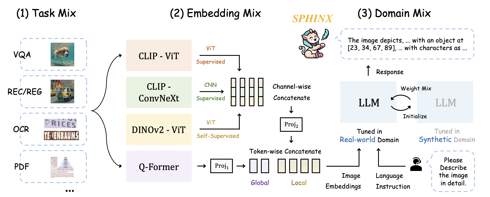
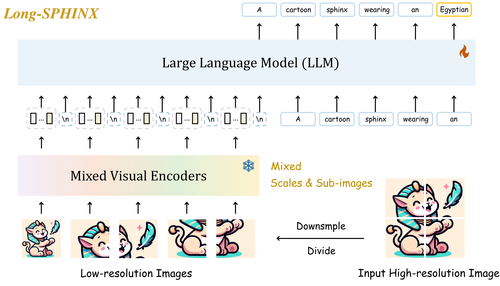

# 🔥 SPHINX: A Mixer of Tasks, Domains, and Embeddings

Official implementation of ['SPHINX: A Mixer of Tasks, Domains, and Embeddings Advances Multi-modal Large Language Models'](https://github.com/Alpha-VLLM/LLaMA2-Accessory/blob/main/SPHINX/SPHINX_paper.pdf).

Try out our [web demo 🚀](http://imagebind-llm.opengvlab.com/) here!
<p align="center">
   🤗 <a href="https://huggingface.co/Alpha-VLLM/SPHINX" target="_blank">HF Repo</a> • 👋 join our <a href="http://imagebind-llm.opengvlab.com/qrcode/" target="_blank">WeChat</a>
</p>

## News
* **[2024-1-12]** We release SPHINX-Tiny built on the compact 1.1B [TinyLlama](https://huggingface.co/TinyLlama/TinyLlama-1.1B-intermediate-step-1195k-token-2.5T) that everyone can play with! 🔥🔥🔥
* **[2024-1-5]** We release SPHINX-MoE supercharged with the powerful [Mixtral 8x7B](https://llama2-accessory.readthedocs.io/en/latest/projects/mixtral-8x7b.html) Backbone! 🔥🔥🔥
* **[2023-11-17]** We release SPHINX-V2, the same architecture but enhanced capabilities! 🔥🔥
* **[2023-11-09]** We release the [technical report](https://github.com/Alpha-VLLM/LLaMA2-Accessory/blob/main/SPHINX/SPHINX_paper.pdf) of SPHINX 🔥.
* **[2023-10-17]** We release the demo, code, and model of SPHINX 🎉.

## Introduction

We present $\color{goldenrod}{SPHINX}$, a versatile multi-modal large language model (MLLM) with a mixer of training tasks, data domains, and visual embeddings. 

- **Task Mix.** For all-purpose capabilities, we mix a variety of vision-language tasks for mutual improvement: VQA, REC, REG, OCR, DET, POSE, REL DET, T2I, etc.

- **Embedding Mix.** We capture robust visual representations by fusing distinct visual architectures, pretraining, and granularity.

- **Domain Mix.** For data from real-world and synthetic domains, we mix the weights of two domain-specific models for complementarity.

<p align="center">                                                                                                                                           <br>
</p>

On top of SPHINX, we propose to further mix visual scales and sub-images for better capture fine-grained semantics on high-resolution images.
<p align="center">                                                                                                                                          
   <br>
</p>

## Inference
### Installation
+ SPHINX is built upon LLaMA2-Accessory, please follow the instructions [here](https://llama2-accessory.readthedocs.io/en/latest/install.html) for environment setup.
+ **Important 🔦:** For flexible instantiation of SPHINX models, please set up the LLaMA2-Accessory repo to your python environment.
  ``` bash
  # go to the root directory of LLaMA2-Accessory
  cd LLaMA2-Accessory
  # install LLaMA2-Accessory 
  pip install -e .
  ```
  After this, you will be able to invoke `import accessory` or `import SPHINX` without the restriction of working directory.
+ For SPHINX-MoE, [megablocks](https://github.com/stanford-futuredata/megablocks/) and [stk](https://github.com/stanford-futuredata/stk) should be additionally installed according their the official guides.
+ To enable the segmentation ability shown in our official demo, SAM is also needed:
    ``` bash
    pip install git+https://github.com/facebookresearch/segment-anything.git
    ```

### Weights

We release the following checkpoints:

| Name           | Architecture                                                      | Checkpoint                                                                                                                                                                               |
|----------------|-------------------------------------------------------------------|------------------------------------------------------------------------------------------------------------------------------------------------------------------------------------------|
| SPHINX         | [llama_ens](../accessory/model/LLM/llama_ens.py)                  | [Hugging face](https://huggingface.co/Alpha-VLLM/LLaMA2-Accessory/tree/main/finetune/mm/SPHINX/SPHINX)/[Baidu](https://pan.baidu.com/s/1HE6NoF1ZawhMgJxeh9r2kQ?pwd=46s7)(提取码：46s7)       |
| SPHINX-1K      | [llama_ens5](../accessory/model/LLM/llama_ens.py)                 | [Hugging face](https://huggingface.co/Alpha-VLLM/LLaMA2-Accessory/tree/main/finetune/mm/SPHINX/SPHINX-1k)/[Baidu](https://pan.baidu.com/s/1SRfyFGJdapaUTgYZOAdXyg?pwd=pua9)(提取码：pua9)    |
| SPHINX-v2-1k   | [llama_ens5](../accessory/model/LLM/llama_ens.py)                 | [Hugging face](https://huggingface.co/Alpha-VLLM/LLaMA2-Accessory/tree/main/finetune/mm/SPHINX/SPHINX-v2-1k)/[Baidu](https://pan.baidu.com/s/1PKCf515EGmSnSZ8teERHjQ?pwd=88z0)(提取码：88z0) |
| SPHINX-MoE     | [mixtral_sparse_ens](../accessory/model/LLM/mixtral_sparse_ens.py) | [Hugging face](https://huggingface.co/Alpha-VLLM/LLaMA2-Accessory/tree/main/finetune/mm/SPHINX/SPHINX-MoE)                                                                               |
| SPHINX-MoE-1k  | [mixtral_sparse_ens5](../accessory/model/LLM/mixtral_sparse_ens5.py) | [Hugging face](https://huggingface.co/Alpha-VLLM/LLaMA2-Accessory/tree/main/finetune/mm/SPHINX/SPHINX-MoE-1k)                                                                            |
| SPHINX-Tiny    | [llama_ens_light.py](../accessory/model/LLM/llama_ens_light.py)   | [Hugging face](https://huggingface.co/Alpha-VLLM/LLaMA2-Accessory/tree/main/finetune/mm/SPHINX/SPHINX-Tiny)                                                                              |
| SPHINX-Tiny-1k | [llama_ens5_light.py](../accessory/model/LLM/llama_ens5_light.py) | [Hugging face](https://huggingface.co/Alpha-VLLM/LLaMA2-Accessory/tree/main/finetune/mm/SPHINX/SPHINX-Tiny-1k)                                                                           |

*Note that SPHINX-1K was previously called Long-SPHINX*

Please download them to your own machine. The file structure should appear as follows:

```
path/to/checkpoint
├── consolidated.00-of-02.model.pth
├── consolidated.01-of-02.model.pth
├── tokenizer.model
├── config.json
└── meta.json
```

### Inference

#### Single-GPU Inference
```python
from SPHINX import SPHINXModel
from PIL import Image
import torch

# Besides loading the `consolidated.*.pth` model weights, from_pretrained will also try to 
# use `tokenizer.model', 'meta.json', and 'config.json' under `pretrained_path` to configure
# the `tokenizer_path`, `llama_type`, and `llama_config` of the model. You may also override
# the configurations by explicitly specifying the arguments
model = SPHINXModel.from_pretrained(pretrained_path="path/to/checkpoint", with_visual=True)

image = Image.open("examples/1.jpg")
qas = [["What's in the image?", None]]

response = model.generate_response(qas, image, max_gen_len=1024, temperature=0.9, top_p=0.5, seed=0)

print(response)

# if you wanna continue
qas[-1][-1] = response
qas.append(["Then how does it look like?", None])
response2 = model.generate_response(qas, image, max_gen_len=1024, temperature=0.9, top_p=0.5, seed=0)

print(response2)
```

#### Multi-GPU inference
```python
from SPHINX import SPHINXModel
from PIL import Image
import torch
import torch.distributed as dist
import multiprocessing as mp

def main(world_size, rank) -> None:
    dist.init_process_group(
        backend="nccl", rank=rank, world_size=world_size,
        init_method=f"tcp://127.0.0.1:23560",
    )
    torch.cuda.set_device(rank)
    
    # mp_group tells the model which ranks will work together
    # through model parallel to compose a complete model.
    # When mp_group is None, a single-rank process group will
    # be created and used, which means model parallel size = 1 (not enabled)
    model = SPHINXModel.from_pretrained(
        pretrained_path="path/to/checkpoint", with_visual=True,
        mp_group=dist.new_group(ranks=list(range(world_size)))
    ) 
    
    # it's important to make sure that ranks within the same 
    # model parallel group should always receive the same input simultaneously
    image = Image.open("examples/1.jpg")
    qas = [["What's in the image?", None]]

    response = model.generate_response(qas, image, max_gen_len=1024, temperature=0.9, top_p=0.5, seed=0)


if __name__ == "__main__":
    N_GPU = 2
    assert N_GPU in [1, 2, 4, 8]
    if N_GPU == 1:
        main(world_size=1, rank=0)
    else:
        # You can use whatever method, e.g. torchrun, slurm, etc. for distributed launch
        # Just be sure to initialize torch distributed (by invoking dist.init_process_group)
        # before creating the SPHINX model if model parallel size > 1 is used
        mp.set_start_method("spawn")
        for rank in range(N_GPU):
            process = mp.Process(target=main, args=(N_GPU, rank))
            process.start()
```
If torchrun is preferred, an example is [inference.py](inference.py):
```bash
torchrun --master_port=1112 --nproc_per_node=2 inference.py
```


### Host Local Demo
For thoes who want to host a demo like [our official one](http://imagebind-llm.opengvlab.com/) locally, 
this section provides a step-by-step guide. 
+ [SAM](https://github.com/facebookresearch/segment-anything.git) should be installed to enable segmentation. 
+ *If you're already familiar with the LLAMA2-Accessory toolkit, note that hosting a SPHINX demo follows the same pipeline as hosting demos for the other models supported by LLAMA2-Accessory.*


#### SPHINX
Execute the following command for demo hosting:
``` bash
cd LLaMA2-Accessory/accessory
python demos/multi_turn_mm_box.py --n_gpus=2 \
--pretrained_path /path/to/checkpoint/
```
Explanation of each argument:

+ `--n_gpus`: Number of gpus to use. More GPUs alleviate the memory and computation
load on each GPU through model parallelism. `1,2,4,8` are supported.
+ `--pretrained_path`: The path to pretrained checkpoint

> [!NOTE]
> In the past we required users to manually specify the `llama_type`, `llama_config` and `tokenizer_path` arguments. 
> However, now LLaMA2-Accessory will automatically investigate the files under `pretrained_path` to probe these
> information. If your program raises an error, please make sure that your `pretrained_path` contain all the files
> mentioned [here](#weights).


## Finetune SPHINX
Here we show an example of using LLaMA2-Accessory to finetune SPHINX on ImageNet-1k. 

### Data
We transform the image classification problem into single-turn conversation, with 
"Classify the image." as instruction and "This is a [CLASS]" as response. We provide
the preprocessed training data at 
[🤗accessory_imagenet_train.json](https://huggingface.co/Alpha-VLLM/LLaMA2-Accessory/blob/main/data/imagenet/accessory_imagenet_train.json).
Note that you still need to prepare the ImageNet-1k images by yourself.

Since LLaMA2-Accessory is designed to support the joint finetuning on multiple datasets, 
you need to additionally prepare a `data_config.yaml` file, which specifies the collection
of datasets used for finetuning. The following shows the contents of `data_config.yaml`:
```yaml
META:
  -
    path: 'path/to/accessory_imagenet_train.json'
    type: 'text'
    root: 'path/to/imagenet/images'  # optional
    ratio: 1.0  # optional
```
Since we only use one dataset for this example,  the `META` field in `data_config.yaml` contains only 1 item. For this
item, the four keys has the following meanings:
+ `path`: specifies the path to data annotation file.
+ `type`: when multiple datasets are used for finetuning, LLaMA2-Accessory guarantees that in each global batch
(batch size per GPU * data parallel size * accumulate grad iterations), all data samples are from datasets of the 
same `type`. For example, when the training set consists of both text-only and image-text datasets, the two kind 
of datasets should have different `type` values.
+ `root`: optional; when specified, the image paths in the dataset will be considered as relative path to `root`.
+ `ratio`: optional; when specified, before training the dataset will be randomly sampled by the ratio.

If you are interested, please refer to [dataset.py](../accessory/data/conversation/dataset.py)
for the underlying implementation.

### Finetuning
Suppose you have prepared [SPHINX-v2-1k](#weights) at `/path/to/sphinx-v2-1k`, and `data_config.yaml` at 
`path/to/data_config.yaml`, you can now start finetuning with the following script:
```bash
#!/bin/bash
#SBATCH --gres=gpu:8
#SBATCH -n 16
#SBATCH --ntasks-per-node 8
#SBATCH --cpus-per-task=16

llama_type=llama_ens5  # llama_ens5 for sphinx-v2-1k and sphinx-1k, llama_ens for sphinx
pretrained_path=/path/to/sphinx-v2-1k
llama_config=/path/to/sphinx-v2-1k/params.json
tokenizer_path=/path/to/sphinx-v2-1k/tokenizer.model
data_config=path/to/data_config.yaml

data_parallel=sdp
model_parallel=2

lr=0.00002  # We recommend 5e-6 for SPHINX-MoE and SPHINX-MoE-1k, and 2e-5 for others

exp_name=finetune/imagenet/sphinx-v2-1k/
echo "exp name: $exp_name"
mkdir -p output/"$exp_name"

srun python -u main_finetune.py \
--output_dir output/"$exp_name" --epochs 1 --warmup_epochs 0.03 \
--batch_size 4 --accum_iter 4 --num_workers 2 \
--max_words 512 \
--lr "$lr" --min_lr 0 --clip_grad 8 --weight_decay 0 \
--data_parallel "$data_parallel" --model_parallel_size "$model_parallel" --checkpointing \
--llama_type llama_ens5 --llama_config $llama_config --tokenizer_path "$tokenizer_path" \
--pretrained_path "$pretrained_path" --pretrained_type="$pretrained_type" \
--data_config $data_config --dialog \
--image_transform padded_resize \
2>&1 | tee -a output/"$exp_name"/output.log

echo "exp name: $exp_name"
```

Note that the working directory for running the script should be `LLaMA2-Accessory/accessory`.
