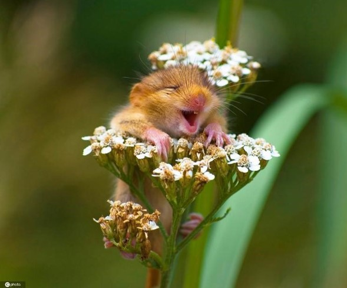
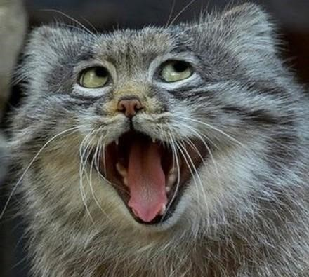
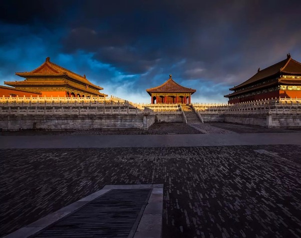
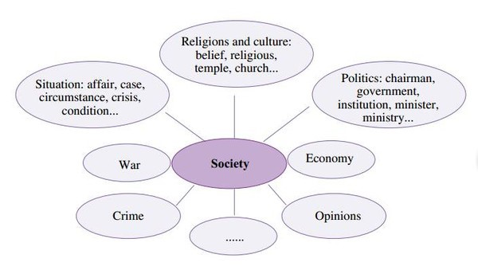

# Demos of Multi-Model LLaMA 2

## Stage One

**Without prefix prompt**

*Answer*: A group of flamingos standing on top of a lush green field.

**With prefix prompt**

prefix prompt: 'The author'

*Answer*: The author of this painting is Vincent Van Gogh.

## Stage Two

*Instruction:*

Describe the image.

*Answer:*

The image features a colorful background with a large, eye-catching banner displaying the "Summer Power Sale." The banner has a blue, yellow, and pink color scheme, and the text is in a bold, modern font. The sale sign has a prominent "50" symbol, indicating the discount or promotional offer. The overall design of the banner is visually appealing and effectively conveys the message of the summer, limited-time offer to potential customers.

*Instruction:*

What are the emotions of the animal in the picture?

*Answer:*

The animal in the picture appears to be happy and relaxful, as it is smiling and laughing while sitting on the flower.

*Instruction:*

What is the food in the picture? Provide recipes for making the food in the picture.

*Answer:*

The food in the picture is a set of macaroons, which is a type of small, round, and crispy pastry. Macaroons are typically made with ingredients such as almond flour, butter, sugar, and egg whites. There are several recipes available online for making these delicious treats, such as the following:

**Almond-covered Macaroons:**

**Ingredients:**

- 1 cup of almond flour
- 1/2 cup of granulated sugar
- 1/4 cup of unsalted butter, melted
- 1 teaspoon of vanilla extract
- a few drops of food coloring (optional)

**Instructions:**
1. Preheat your oven to 350°F (175°C). Line a baking sheet with parchment paper.
2. In a large mixing bowl, mix together the almond flour, granulated sugar, and melted butter. Add the vanilla extract and mix well.
3. Add a few drops of food coloring, if using, and mix again.
4. Scoop small portions of the mixture and place them on the prepared baking sheet, ensuring enough space between each macaroon.

*Instruction:*

What is the creature in the picture? What was its expression like?

*Answer:*

The creature in the picture is a cat with its mouth wide open, showing its large, long, razor-sharp teeth aggressively. Its tongue is sticking out, and it appears to be growling or hissing menacingly.

*Instruction:*

What style is the building in the picture? Where is it likely to be located?

*Answer:*

The building in the picture is likely of Chinese style, given it is described as a Chinese palace. The presence of the Forbidden City in the background further supports this idea, as the Forbidden City is a famous palace complex in Beijing, China.

*Instruction:*

Describe and summarize the logical relationships in the diagram

*Answer:*

The diagram displays a relationship map between various concepts, with each concept positioned at the center of the circle. The map includes the following concepts: religion, culture, belief, church, state, economy, war war. These concepts are interconnected, with each one influencing the other. For example, religion and culture are closely related, as they both contribute to the development of beliefs and customs. The state often has an impact on the economy, as it regulates businesses and resources. War can result from conflicts over resources, beliefs, or political ideologies. The diagram illustrates how these concepts are interconnected and can affect one another, creating a clear representation of the complex relationships between the various elements in society.

*Instruction:*

Describe the picture in the image below. What is the artistic and aesthetic value of this picture?

*Answer:*

The image is a stunning visual representation of a waterfall with an impressive full moon rising behind it. The artistic and aesthetic value of this picture lie in the combination of the natural beauty of the waterfall and the captivating contrast between the bright, illuminated moon and the dark, shadows within the scene.The image captures the play of light and shadows, with the moon's light shining on the water and casting a glow on the surrounding landscape. The waterfall's flow creates a dynamic element, the composition, adding a sense of movement and energy to the scene. The contrast between the luminous moon and the dark shadows adds depth and richness to the image, making it visually striking and appealing.Moreover, the image may evoke emotions of tranquility, awe, and admiration for the beauty of nature. It encourages viewers to appreciate the interplay between light and dark, as well as the delicate balance between the waterfall and the moon. Overall, the picture is a beautiful and captivating piece of art that showcases the wonders and splendor of the natural world.