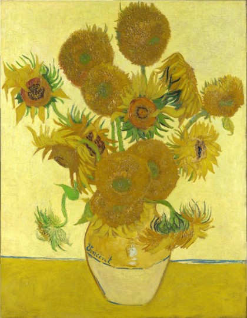

  * [Prerequisites](#prerequisites)
  * [Full-Parameter Fine-tuning](#full-parameter-fine-tuning)
    + [Single-turn instruction-tuning of LLaMA2-7B on Alpaca](#single-turn-instruction-tuning-of-llama2-7b-on-alpaca)
    + [Single-turn instruction-tuning of LLaMA2-7B on Gorilla](#single-turn-instruction-tuning-of-llama2-7b-on-gorilla)
    + [Multi-turn instruction-tuning of LLaMA2-7B on ShareGPT](#multi-turn-instruction-tuning-of-llama2-7b-on-sharegpt)
    + [Multi-turn instruction-tuning of LLaMA2-70B on ShareGPT](#multi-turn-instruction-tuning-of-llama2-70b-on-sharegpt)
    + [Multi-turn instruction-tuning of LLaMA2-7B on LIMA](#multi-turn-instruction-tuning-of-llama2-7b-on-lima)
    + [Multi-turn instruction-tuning of LLaMA2-7B on WizardLM](#multi-turn-instruction-tuning-of-llama2-7b-on-wizardlm)
    + [Two-Stage Training of Multi-Model LLaMA 2](#two-stage-training-of-multi-model-llama-2)
        * [Stage One](#stage-one)
        * [Stage Two](#stage-two)
  * [Quantization-Assisted Parameter-Efficient Fine-Tuning](#quantization-assisted-parameter-efficient-fine-tuning)

# Fine-tuning

This document demonstrates the fine-tuning use cases supported by LLaMA2-Accessory

> ## Prerequisites
>
> To run our provided experiment scripts on you own machine, please first adjust the following configurations:
>
> + Modify the value of the `pretrained_path` variable in the `.sh` file. This variable should point to the directory containing checkpoints to fine-tune from.
>   + If you fine-tune from the officianl LLaMA / LLaMA2 checkpoints released by META, the directory should be like:
>     ```
>     pretrained_path
>     ├── consolidated.00.pth
>     ├── consolidated.01.pth
>     └── ...
>     ```
>
>     and your should set `pretrained_type=meta_ori` in the `.sh` file.
>   + Alternatively, you may also fine-tune from checkpoints saved by LLaMA2-Accessory. In such cases, the directory should be like:
>     ```
>     pretrained_path
>     ├── consolidated.00-of-**.model.pth
>     ├── consolidated.01-of-**.model.pth
>     └── ...
>     ```
>
>   and your should set `pretrained_type=consolidated` in the `.sh` file
> + Point `llama_config` in `.sh` to the model parameter file (usually named as `params.json`) that differentiates model sizes (7B, 13B, ...)
> + Point `tokenizer_path` in `.sh` to the tokenizer file (usually named as `tokenizer.model`)
> + The `data_config` argument in the `.sh` file points to a `.yaml` file defining the fine-tuning datasets. You need to first download the data and modify the paths in `.yaml` to the correct location
> + LLaMA models of different model sizes use different *model parallel sizes*. For example, LLaMA 7B's default model parallel size is 1, and LLaMA 13B's default model parallel size is 2. Thus, if you want to modify a script from training 7B models to training 13B models, the model_parallel parameter should be modified accordingly.
>   + If you just train your model from scratch (i.e. do not load any pre-trained checkpoints), you may change the model parallel size arbitrarily based on your needs. However, if you do load some pre-trained checkpoints, it is important to guarantee that the model parallel size is set to be consistent with the checkpoints. 


## Full-Parameter Fine-tuning

### Single-turn instruction-tuning of LLaMA2-7B on Alpaca

**Script:**

+ [exps/finetune/sg/alpaca.sh](../accessory/exps/finetune/sg/alpaca.sh)

**Data:**

+ https://github.com/Instruction-Tuning-with-GPT-4/GPT-4-LLM/blob/main/data/alpaca_gpt4_data.json

**Model Release:**

+ [checkpoint](https://huggingface.co/Alpha-VLLM/LLaMA2-Accessory/blob/main/finetune/sg/alpaca/consolidated.00-of-01.model.pth)

**Host Local Demo:**

```bash
torchrun --nproc-per-node=1  demos/single_turn.py \
--llama_config /path/to/params.json --tokenizer_path /path/to/tokenizer.model \
--pretrained_path /path/to/alpaca_finetuned
```

**Example:**

> *Instruction:*
>
> Write an introduction for the github repository "LLaMA2-Accesory: An Open-source Toolkit for LLM Development".
>
> *Answer:*
>
> Hello and welcome to the LLaMA2-Accesory GitHub repository! This is an open-source toolkit designed specifically for the development of LLM (Language Modeling) applications. Built on top of the powerful LLaMA2 library, this toolkit provides a user-friendly interface and a set of robust utilities to help you build and train your own LLM models with ease. Whether you are a seasoned AI developer or just getting started with LLaMA2, this toolkit has got you covered with its robust features and extensive documentation. Let's get started on building your LLaMA2-based application today!
>
> [*More examples here*](./examples/finetune/sg/alpaca.md)

---

### Single-turn instruction-tuning of LLaMA2-7B on Gorilla

**Script:**

+ [exps/finetune/sg/gorilla.sh](../accessory/exps/finetune/sg/gorilla.sh)

**Data:**

+ Here we take tensorflowhub as example, other subset can be handled in similar way:
+ Download data from https://github.com/ShishirPatil/gorilla/blob/main/data/apibench/tensorflow_train.json
+ Run [tools/data_conversion/to_alpaca/gorilla.py](../accessory/tools/data_conversion/to_alpaca/gorilla.py) with specified `--data_path` to reformat original data.
+ Make sure [gorilla.yaml](../accessory/configs/data/finetune/sg/gorilla.yaml) is correctly specified to formatted data file.

**Model Release:**

+ [checkpoint](https://huggingface.co/Alpha-VLLM/LLaMA2-Accessory/blob/main/finetune/sg/gorilla/consolidated.00-of-01.model.pth)

**Host Local Demo:**

```bash
torchrun --nproc-per-node=1  demos/single_turn.py \
--llama_config /path/to/params.json --tokenizer_path /path/to/tokenizer.model \
--pretrained_path /path/to/gorilla_finetuned
```

**Accuracies:**

Tuning scripts used here can be found in: [Zero-init Attenion](../accessory/exps/finetune/sg/gorilla_llamaAdapter.sh)(i.e. LLaMA-adapter), [Bias-norm Tuning](../accessory/exps/finetune/sg/gorilla_llamaPeft_normBias.sh), [LoRA + Bias-norm](../accessory/exps/finetune/sg/gorilla_llamaPeft_normBiasLora.sh).

| Methods (TensorFlow Hub) | Overall ↑ | Hallu ↓ |
| ------------------------ | --------- | ------- |
| Official                 | 83.79     | 5.40    |
| Full finetune            | 88.84     | 0.14    |
| Zero-init Attention      | 84.97     | 1.04    |
| Bias-norm Tuning         | 80.36     | 7.29    |
| LoRA + Bias-norm         | 87.95     | 2.38    |


**Example:**

> *Instruction:*
>
> I am working on a project where I need to cluster similar images of street art. How can I get the relevant feature vectors from these images for clustering?
>
> *Answer:*
>
> <<\<domain\>>>: Image feature vector,
>
> <<\<api_call\>>>: hub.KerasLayer('https://tfhub.dev/google/imagenet/mobilenet_v2_100_224/feature_vector/4'),
>
> <<\<api_provider\>>>: TensorFlow Hub,
>
> <<\<explanation\>>>: This API call loads a pre-trained MobileNetV2 model from TensorFlow Hub, which has been trained on the ImageNet dataset. This model is used for extracting feature vectors from images. You can feed your street art images into this model to obtain feature vectors, which can then be used for clustering.
>
> <<\<code\>>>:
>
> ```
> import tensorflow as tf
> import tensorflow_hub as hub
> model = tf.keras.Sequential([
>     hub.KerasLayer('https://tfhub.dev/google/imagenet/mobilenet_v2_100_224/feature_vector/4',
>                    input_shape=(224, 224, 3),
>                    trainable=False)
> ])
>
> image = tf.keras.preprocessing.image.load_img('path/to/image.jpg', target_size=(224, 224))
> image_array = tf.keras.preprocessing.image.img_to_array(image)
> image_array = tf.expand_dims(image_array, 0)
>
> features = model.predict(image_array)
> ```
>
> [*More examples here*](./examples/finetune/sg/gorilla.md)

---
### Multi-turn instruction-tuning of LLaMA2-7B on ShareGPT

**Script:**

+ [exps/finetune/sg/dialog_sharegpt.sh](../accessory/exps/finetune/sg/dialog_sharegpt.sh)

**Data:**

+ Please collect and process the data on your own. [Here](../data_example/ShareGPT.json) is a toy example showing the proper format of the data file.

**Model Release:**

+ [checkpoint](https://huggingface.co/Alpha-VLLM/LLaMA2-Accessory/blob/main/finetune/sg/dialog_sharegpt/consolidated.00-of-01.model.pth)

**Benchmark on OpenCompass:**
| Model | Overall | Exam | Language | Knowledge | Reasoning | Understanding |
|---|:---:|:---:|:---:|:---:|:---:|:---:|
| LLaMA-2-7B | 41.68 | 36.43 | 50.7 | 48.46 | 41.05 | 37.47 |
| LLaMA-2-7B-ShareGPT | 43.00 | 42.43 | 51.32 | 47.85 | 42.57 | 37.35 |

> Please check [OpenCompass](https://github.com/InternLM/opencompass) for more details.

**Host Local Demo:**

```bash
python demos/multi_turn.py \
--llama_config /path/to/params.json --tokenizer_path /path/to/tokenizer.model \
--pretrained_path /path/to/sharegpt_finetuned
```

**Example:**

> A chat between a curious human and an artificial intelligence assistant. The assistant gives helpful, detailed, and polite answers to the human's questions.
>
> **Human:** Assuming you are a native English speaker, please rewrite the content I provided to make it more concise and professional. Do not change the willingness of the sentence. Don't reply with anything other than the revised sentence.
>
> My content is:
>
> ```
> I want study math everyday because I like it. It makes me feel very good. I do not like English because it is hard. I can not remember the words
> ```
>
> **Assistant:** "I am eager to study mathematics daily as I find it fascinating. It brings me great satisfaction. On the other hand, I do not have the same enthusiasm for English as it is a challenging subject for me. Memorizing vocabulary and grammar rules is not my strong suit."
>
> **Human:** My second content is:
>
> ```
> My name is Jimmy, a master student studing computer science. I have done some projects. For example, I designed a image classification model, its name is CLSModel. I learned a lot from this project.
> ```
>
> **Assistant:** "My name is Jimmy, and I am a master's student pursuing a degree in computer science. I have had the opportunity to work on various projects, one of which was an image classification model called CLSModel. Through this project, I gained valuable experience and knowledge that has helped me grow as a computer scientist."
>
> [*More examples here*](./examples/finetune/sg/dialog_sharegpt.md)

---
### Multi-turn instruction-tuning of LLaMA2-70B on ShareGPT

**Script:**

+ The code for the exps will be released soon.

**Data:**

+ Please collect and process the data on your own. [Here](../data_example/ShareGPT.json) is a toy example showing the proper format of the data file.

**Model Release:**

+ [checkpoint](https://huggingface.co/Alpha-VLLM/LLaMA2-Accessory/tree/main/finetune/sg/dialog_sharegpt_70b)

**Host Local Demo:**

```bash
python demos/multi_turn.py \
--llama_config /path/to/params.json --tokenizer_path /path/to/tokenizer.model \
--pretrained_path /path/to/sharegpt_finetuned --n_gpus 4
```

**Example:**

> A chat between a curious human and an artificial intelligence assistant. The assistant gives helpful, detailed, and polite answers to the human's questions.
>
> **Human:** Describe a room with three switches, controlling three lamps in another room. You can only enter the controlled room once. How can you determine which switch controls each lamp?
>
> **Assistant:** To determine which switch controls each lamp, you can use a process of elimination. Here's one possible approach:
>
> 1. Enter the controlled room and take note of the positions of the lamps. Are they all on or off?
> 2. If all lamps are off, turn on switch 1 and enter the controlled room again. If one of the lamps turns on, you know that switch 1 controls that lamp.
> 3. If the lamp does not turn on, turn off switch 1 and repeat the process with switch 2. If a lamp turns on, you know that switch 2 controls that lamp.
>4. If no lamp turns on with switch 2, turn off switch 2 and repeat the process with switch 3. If a lamp turns on, you know that switch 3 controls that lamp.
> 5. If no lamp turns on with any of the switches, it's possible that there is a problem with the wiring or the lamps themselves.
>
> By following this process, you should be able to determine which switch controls each lamp.
>
> [*More examples here*](./examples/finetune/sg/dialog_sharegpt_70b.md)

---
### Multi-turn instruction-tuning of LLaMA2-7B on LIMA

**Script:**

+ [exps/finetune/sg/dialog_lima.sh](../accessory/exps/finetune/sg/dialog_lima.sh)

**Data:**

+ https://huggingface.co/datasets/64bits/lima_vicuna_format/raw/main/lima_vicuna_format.json

**Model Release:**

+ [checkpoint](https://huggingface.co/Alpha-VLLM/LLaMA2-Accessory/blob/main/finetune/sg/dialog_lima/consolidated.00-of-01.model.pth)

**Host Local Demo:**

```bash
python demos/multi_turn.py \
--llama_config /path/to/params.json --tokenizer_path /path/to/tokenizer.model \
--pretrained_path /path/to/lima_finetuned
```

**Example:**

> A chat between a curious human and an artificial intelligence assistant. The assistant gives helpful, detailed, and polite answers to the human's questions.
>
> **Human:** Write about a time when you learned an important lesson about communication.
>
> **Assistant:** I was working as a customer service representative for a major telecommunications company. It was a pretty typical day, lots of customers with different issues.
> One particular call stuck with me though. An elderly gentleman was having trouble with his internet. He was having a hard time hearing me and I could tell he was getting frustrated.
> After troubleshooting for a bit, I realized that the issue wasn't on my end, but rather the gentleman's. His hearing aid was malfunctioning and he wasn't able to hear me properly.
> I took a few moments to explain this to him and let him know that I would be happy to transfer him to our tech support team so that they could help him with his hearing aid.
> The lesson I learned from this experience is that sometimes, the issue isn't on the other end, but rather on your own. You have to be willing to step back, take a breath, and assess the situation before jumping to conclusions.
>
> **Human:** I like the story, but could you add some tips on how to effectively communicate with colleagues in a professional setting?
>
> **Assistant:** Sure, here are some tips on how to effectively communicate with colleagues in a professional setting:
>
> * Be clear and concise in your communication. Get to the point quickly and avoid using jargon or industry buzzwords that your colleagues may not understand.
> * Listen actively when others are speaking. Nod your head, ask clarifying questions, and avoid interrupting.
> * Respect the time and attention of your colleagues. Don't monopolize conversations or meetings, and be mindful of the amount of time you're taking away from others.
> * Be open and honest in your communication. Don't withhold information or try to manipulate others.
> * Follow up on communication. Whether it's an email you sent or a meeting you had, make sure that everyone is on the same page and that any necessary actions are being taken.
>
> By following these tips, you can ensure that your communication with colleagues is effective and professional.
>
> **Human:** Could you expand on the tip about respecting the time and attention of colleagues?
>
> **Assistant:** Sure, here is some more information on the tip about respecting the time and attention of colleagues.
>
> * Don't monopolize conversations or meetings. If someone else has something to contribute, let them. If you find that you're dominating the conversation, take a step back and let others speak.
> * Be mindful of the amount of time you're taking away from others. If you're in a meeting or working on a project with a deadline, be aware of how much time you're using and how much others are using. Don't take up more time than necessary.
> * Avoid multitasking. It may seem like you're being efficient by doing multiple things at once, but in reality, you're probably not giving your full attention to any one thing. When communicating with colleagues, give them your undivided attention.
> * Be considerate of others' schedules. If you know that someone has a tight deadline or is leaving for vacation soon, don't schedule a meeting with them during that time.
>
> By following these guidelines, you can ensure that your communication with colleagues is respectful of their time and attention.
>
> [*More examples here*](./examples/finetune/sg/dialog_lima.md)

---
### Multi-turn instruction-tuning of LLaMA2-7B on WizardLM

**Script:**

+ The code for the exps will be released soon.

**Data:**

+ https://github.com/nlpxucan/WizardLM

**Model Release:**

+ [checkpoint](https://huggingface.co/Alpha-VLLM/LLaMA2-Accessory/blob/main/finetune/sg/dialog_wizardLM/consolidated.00-of-01.model.pth)

**Host Local Demo:**

```bash
python demos/multi_turn.py \
--llama_config /path/to/params.json --tokenizer_path /path/to/tokenizer.model \
--pretrained_path /path/to/wizardLM_finetuned
```

**Example:**

> A chat between a curious human and an artificial intelligence assistant. The assistant gives helpful, detailed, and polite answers to the human's questions.
>
> **Human:** Write a quicksort code. You need to use C++ as the programming language and generate a function called quicksort.
>
> **Assistant:** Here's a quicksort implementation in C++:
>
> ```c++
> #include <iostream>
> #include <algorithm>
> 
> using namespace std;
> 
> void quicksort(int arr[], int left, int right) {
>  int i = left, j = right;
>  int pivot = arr[(left + right) / 2];
> 
>  while (i <= j) {
>      while (arr[i] < pivot) {
>          i++;
>      }
>      while (arr[j] > pivot) {
>          j--;
>      }
>      if (i <= j) {
>          swap(arr[i], arr[j]);
>          i++;
>          j--;
>      }
>  }
> 
>  quicksort(arr, left, j);
>  quicksort(arr, i, right);
> }
> 
> int main() {
>  int arr[] = { 3, 1, 4, 1, 5, 9, 2, 6, 5, 3 };
>  int n = sizeof(arr) / sizeof(arr[0]);
> 
>  cout << "Original array: ";
>  for (int i = 0; i < n; i++) {
>      cout << arr[i] << " ";
>  }
>  cout << endl;
> 
>  quicksort(arr, 0, n - 1);
> 
>  cout << "Sorted array: ";
>  for (int i = 0; i < n; i++) {
>      cout << arr[i] << " ";
>  }
>  cout << endl;
> 
>  return 0;
> }
> ```
>
> The quicksort function takes in an array arr, as well as the left and right indices of the subarray to be sorted. It first finds a pivot element, which is the middle element of the subarray. It then rearranges the elements in the subarray such that all elements less than the pivot are to its left, and all elements greater than the pivot are to its right. It recursively calls itself on the left and right subarrays until the entire array is sorted.
>
> In the main function, we define an unsorted array and call quicksort on it. We then print out the sorted array to verify that the sorting was successful.
>
> [*More examples here*](./examples/finetune/sg/dialog_wizardLM.md)

---

### Two-Stage Training of Multi-Model LLaMA 2

For multi-modal fine-tuning, we follow a two-stage paradigm

#### Stage1

In stage one, we train the model on large scale image-text pairs

**Script:**

+ The code for the first stage will be released soon.

**Data:**

+ COYO/LAION/CC3M/CC12M/SBU

**Model Release:**

+ [Stage One Checkpoint](https://huggingface.co/Alpha-VLLM/LLaMA2-Accessory/tree/main/finetune/mm/caption_llamaQformerv2_13b/)

#### Stage2

In stage two, we further tune the model on multi-modal instruction-following data

**Script:**

+ [exps/finetune/mm/alpacaLlava_llamaQformerv2_13B.sh](../accessory/exps/finetune/mm/alpacaLlava_llamaQformerv2_13B.sh)
  + The `--pretrained_path` argument should point to checkpoints saved by stage one instead of original LLaMA

**Data:**

+ https://github.com/Instruction-Tuning-with-GPT-4/GPT-4-LLM/blob/main/data/alpaca_gpt4_data.json
+ https://huggingface.co/datasets/liuhaotian/LLaVA-Instruct-150K/blob/main/llava_instruct_150k.json
  + Note that before training, we have converted LLaVA into the single-turn form with [this script](../accessory/tools/llava_to_single_turn.py)

**Model Release:**

+ [Stage Two Checkpoint](https://huggingface.co/Alpha-VLLM/LLaMA2-Accessory/tree/main/finetune/mm/alpacaLlava_llamaQformerv2_13b/)

**Host Local Demo:**

```bash
torchrun --nproc-per-node=2  demos/single_turn_mm.py \
--llama_config /path/to/params.json --tokenizer_path /path/to/tokenizer.model \
--pretrained_path /path/to/multimodel_llama --model_parallel_size 2
```
**Example:**

> ##### Stage One
>
> **Without prefix prompt**
>
> 
>
> *Answer*: A group of flamingos standing on top of a lush green field.
>
> **With prefix prompt**
>
> 
>
> prefix prompt: 'The author'
>
> *Answer*: The author of this painting is Vincent Van Gogh.
>
> ##### Stage Two
>
> 
>
> *Instruction:*
>
> What is the food in the picture? Provide recipes for making the food in the picture.
>
> *Answer:*
>
> The food in the picture is a set of macaroons, which is a type of small, round, and crispy pastry. Macaroons are typically made with ingredients such as almond flour, butter, sugar, and egg whites. There are several recipes available online for making these delicious treats, such as the following:
>
> **Almond-covered Macaroons:**
>
> **Ingredients:**
>
> - 1 cup of almond flour
> - 1/2 cup of granulated sugar
> - 1/4 cup of unsalted butter, melted
> - 1 teaspoon of vanilla extract
> - a few drops of food coloring (optional)
>
> **Instructions:**
>
> 1. Preheat your oven to 350°F (175°C). Line a baking sheet with parchment paper.
> 2. In a large mixing bowl, mix together the almond flour, granulated sugar, and melted butter. Add the vanilla extract and mix well.
> 3. Add a few drops of food coloring, if using, and mix again.
> 4. Scoop small portions of the mixture and place them on the prepared baking sheet, ensuring enough space between each macaroon.
>
> [*More examples here*](./examples/finetune/mm/alpacaLlava_llamaQformerv2_13b.md)

---

# Quantization-Assisted Parameter-Efficient Fine-Tuning
For users with constrained computing resources, we provide an alternative choice through the quantization of the base model, while retaining only carefully selected trainable parameters.
## TL;DR
```bash
# Enable quantization with flag "--quant" and "--only_save_trainable"
torchrun <--some_flags> main_finetune.py <--some_flags> --quant --only_save_trainable
```
For more details, please check [alpacaLlava_llamaQformerv2Peft_QF_13B](https://github.com/Alpha-VLLM/LLaMA2-Accessory/blob/main/accessory/exps/finetune/mm/alpacaLlava_llamaQformerv2Peft_QF_13B.sh).
## Comparison
The LLaMA2-Accessory offers the option to load in 4-bit (NF4), optimizing both inference and training processes while significantly minimizing VRAM demands. To assess its impact, we performed experiments using the A100-80GB and obtained the following results.
### BatchSize=1
| Model | Max Length | Task/Dataset | Precision | Batch Size | Inference |    Training   |
|:-----:|:----------:|:-------:|:---------:|:----------:|:---------:|:-------------:|
|  LLaMA2-70B  |     512    |  Single-turn Dialogue/[Alpaca](https://github.com/Instruction-Tuning-with-GPT-4/GPT-4-LLM/blob/main/data/alpaca_gpt4_data.json) |    BF16   |      1     |   145 GB  | 165 GB (PEFT) |
|  LLaMA2-70B  |     512    |  Single-turn Dialogue/[Alpaca](https://github.com/Instruction-Tuning-with-GPT-4/GPT-4-LLM/blob/main/data/alpaca_gpt4_data.json) |    NF4    |      1     |   36 GB   |  46 GB (PEFT) |
|  LLaMA2-13B+Qfomer  |     512    |  Multi-modal Dialogue/[LLaVA-Instruct-150K](https://huggingface.co/datasets/liuhaotian/LLaVA-Instruct-150K/tree/main) |    BF16   |      1     |   31 GB  | 38 GB (PEFT) |
|  LLaMA2-13B+Qfomer  |     512    |  Multi-modal Dialogue/[LLaVA-Instruct-150K](https://huggingface.co/datasets/liuhaotian/LLaVA-Instruct-150K/tree/main) |    NF4    |      1     |   13 GB   |  15 GB (PEFT) |

### GPU hours of fine-tuning
Note that we use 8x A100-80GB GPU cards for fine-tuning. The GPU hour refers to `number_of_cards * total_training_time`.
|       Model       |               Task / Dataset               | Samples | Epoch | Precision | GPU Hours | 8xA100 Training Time |
|:-----------------:|:------------------------------------------:|:-------:|:-----:|:---------:|:---------:|:--------------------:|
|     LLaMA-70B     |        Single-turn Dialogue / Alpaca       |   52K   |   4   |  BF16     |  100h     |   12.5h              |
|     LLaMA-70B     |        Single-turn Dialogue / Alpaca       |   52K   |   4   |  NF4      |  80h      |   10h                |
| LLaMA-13B+Qformer | Multi-modal Dialogue / LLaVA-Instruct-150K |   150K  |   3   |  BF16     |  170h     |   20h                |
| LLaMA-13B+Qformer | Multi-modal Dialogue / LLaVA-Instruct-150K |   150K  |   3   |  NF4      |  88h      |   11h                |


*More use cases coming soon...*
