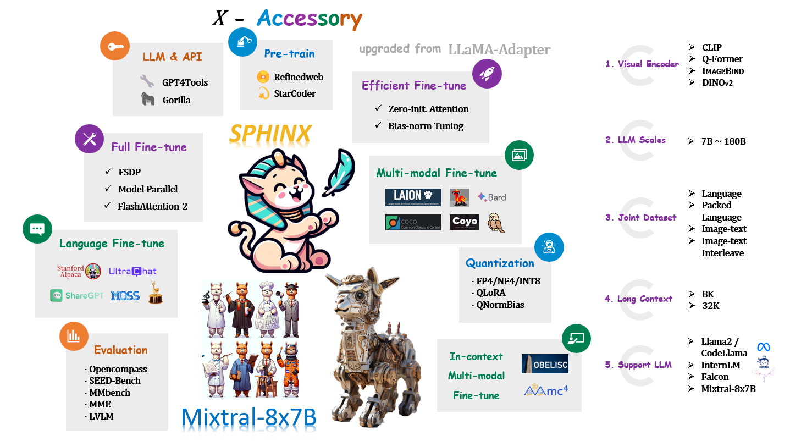

# Overview



🚀**LLaMA2-Accessory** is an open-source toolkit for pretraining, finetuning and deployment of **Large Language Models (LLMs)** and **mutlimodal LLMs**. This repo is mainly inherited from [LLaMA-Adapter](https://github.com/OpenGVLab/LLaMA-Adapter) with more advanced features.🧠

```{toctree}
:caption: Get started
:maxdepth: 2

install
```

```{toctree}
:caption: Tutorials
:maxdepth: 2

pretrain
finetune/index
inference
evaluation
light-eval/index
```

```{toctree}
:caption: Projects
:maxdepth: 2

projects/SPHINX
projects/mixtral-8x7b
```

```{toctree}
:caption: Help
:maxdepth: 2

faq
```